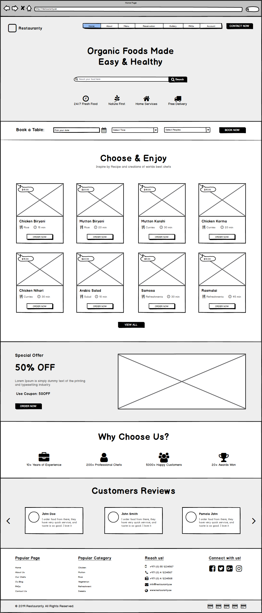

# Informações do Projeto
`TÍTULO DO PROJETO`   

Estrela da Ásia

`CURSO` 

Análise e Desenvolvimento de Sistemas

## Participantes

> Os membros do grupo são: 
> - Patrick de Oliveira Caetano
> - Samyr Endrigo Póvoa de Souza
> - Derick Eduardo dos Santos Orcelino 
> - Thiago Soares de Melo
> - Manuel Calebe da Silva Ribeiro
> - 

# Estrutura do Documento

- [Informações do Projeto](#informações-do-projeto)
  - [Participantes](#participantes)
- [Estrutura do Documento](#estrutura-do-documento)
- [Introdução](#introdução)
  - [Problema](#problema)
  - [Objetivos](#objetivos)
  - [Justificativa](#justificativa)
  - [Público-Alvo](#público-alvo)
- [Especificações do Projeto](#especificações-do-projeto)
  - [Personas e Mapas de Empatia](#personas-e-mapas-de-empatia)
  - [Histórias de Usuários](#histórias-de-usuários)
  - [Requisitos](#requisitos)
    - [Requisitos Funcionais](#requisitos-funcionais)
    - [Requisitos não Funcionais](#requisitos-não-funcionais)
  - [Restrições](#restrições)
- [Projeto de Interface](#projeto-de-interface)
  - [User Flow](#user-flow)
  - [Wireframes](#wireframes)
- [Metodologia](#metodologia)
  - [Divisão de Papéis](#divisão-de-papéis)
  - [Ferramentas](#ferramentas)
  - [Controle de Versão](#controle-de-versão)
- [**############## SPRINT 1 ACABA AQUI #############**](#-sprint-1-acaba-aqui-)
- [Projeto da Solução](#projeto-da-solução)
  - [Tecnologias Utilizadas](#tecnologias-utilizadas)
  - [Arquitetura da solução](#arquitetura-da-solução)
- [Avaliação da Aplicação](#avaliação-da-aplicação)
  - [Plano de Testes](#plano-de-testes)
  - [Ferramentas de Testes (Opcional)](#ferramentas-de-testes-opcional)
  - [Registros de Testes](#registros-de-testes)
- [Referências](#referências)

# Introdução

## Problema

 Nosso projeto tem como objetivo facilitar problemas comuns relacionados a restaurante, como:

1. Deixar seus clientes esperando por atendimento
2. Demorar a entregar os pedidos
3. Atualização de cardápio
4. Faltar sincronia entre os garçons e a equipe da cozinha

 Como esses problemas são normais nesse contexto, terá como solução:
 
 Ferramentas que disponibilizam o cardápio digital atráves da tela de dispositivos móveis utilizados pelos atendentes com a ideia de consultar as informações dos pratos, ingredientes por exemplo. Ter a possibilidade de ver se o restaurante possui vagas disponíveis, como também mesas e por assim adiante. 

## Objetivos

O objetivo geral do nosso site é auxiliar e facilitar o atendimento de nossos clientes, evitando causar dificuldade para ambas partes. 
Objetivos específicos: 

1. Facilidade em vizualizar e agendar reservas, disponibilizando um atendimento prático e rápido.
2. A atualização de cardápios, informando a disponibilidade dos pratos caso esteja fora do cardápio ou em falta, mantendo sempre o cliente informado para que não tenha erros na hora do atendimento e na entrega do pedido.

## Justificativa

Todos nós alguma vez em nossa vida tivemos alguma frustração relacionada a atendimento de restaurantes, tendo que isso é algo comum e não nescessariamente deve ser ignorado pois acaba sendo algo que prejudica tanto os o atendentes, clientes, proprietários e cozinheiros do estabelecimento. Sendo assim é importante solucionarmos problemas neste quesito e a utilização de um software pode facilitar em grande dos problemas relacionados a atendimento, reservas do restaurante, disponibilidade dos pratos no cardápio e por assim em diante.

## Público-Alvo

Nosso público-alvo são homens e mulheres na faixa dos 18 a 50 anos que tendem a ter facilidade ao manuseio com a tecnológia, tendo também conhecimento minímo sobre a cultura para ter interesse em experimentar os alimentos que o restaurante poderá oferecer e que possui interesse culinário asiático. Pessoas que admiram a parte da Ásia que já são acostumadas com as comidas de lá ou que possuem interesse e curiosidade de conhecer e experimentar novos sabores.

# Especificações do Projeto

Aqui temos a apresentação das Personas, dos requisitos não funcionais, dos requisitos funcionais e também das restrições.
Usando essas ferramentas temos uma visão melhor sobre o nosso projeto.

## Personas e Mapas de Empatia

### Persona 1:

-Nome: Sabrina Lara Peixoto
  -Idade: 31
  -Hobby: Gosta de praticar exercício físicos
  -Trabalho: Contabilidade
  -Personalidade: Introvertida
  -Sonhos: Uma casa própria

  -Objetos Físicos e Lugares:
Ela usa o celular em qualquer lugar que estiver, e ela usa o computador no trabalho

  -Objetivos chave:
Para ter mais praticidade na hora de pedir sua comida durante o horário de almoço

  -Como devemos tratá-la:
Devemos tratar com educação e ser rápido no atendimento, comportamentos alegres e simpáticos a deixam feliz

  -Nunca devemos:
Nunca devemos atrasar o pedido dessa cliente, pois ela fica muito nervosa.

### Persona 2:

-Nome: Gustavo Henrique augusto
  -Idade: 22
  -Hobby: Gosta ler e escrever
  -Trabalho: Professor de educação física
  -Personalidade: Extrovertida
  -Sonhos: Carro do ano

  -Objetos Físicos e Lugares:
Ele tem certa facilidade em utilizar o celular independente da situação.

  -Objetivos chave:
Ter acesso em qualquer lugar e praticidade na hora de usar
  
  -Como devemos tratá-la:
Devemos tratar com igualdade sem coisas muito especiais, comportamentos simples.

  -Nunca devemos:
Nunca devemos tratar ele com indiferença, é uma pessoa muito emotiva 

### Persona 3:

  -Nome: Leonardo Garcia Souza
  -Idade: 50
  -Hobby: Gosta de jogar futebol
  -Trabalho: Professor
  -Personalidade: Extrovertido
  -Sonhos: Viajar o mundo

  -Objetos Físicos e Lugares:
Tem certo conhecimento das tecnologias em geral.

  -Objetivos chave:
Que se adapte a sua rotina.

  -Como devemos tratá-la:
Devemos tratar com respeito e igualdade.

  -Nunca devemos:
Nunca devemos tratar com desrespeito e desprezo.

### Persona 4:

  -Nome: Ibsen Souza 
  -Idade: 32 
  -Hobby: andar de moto
  -Trabalho: Cordenador Geral
  -Personalidade:  Extrovertido
  -Sonho: com um mundo melhor

  -Objetos fisicos e Lugares: Celular e notebook disponiveis no trabalho

  -Objetivo chave: Pedir almoço com facilidade na hora do almoço

  -Como devemos tratá-la: Com respeito e igualdade 

  -Nunca devemos: desrespeitar e nem tratar com indiferença

## Histórias de Usuários

Com base na análise das personas forma identificadas as seguintes histórias de usuários:

|EU COMO... `PERSONA`| QUERO/PRECISO ... `FUNCIONALIDADE` |PARA ... `MOTIVO/VALOR`                 |
|--------------------|------------------------------------|----------------------------------------|
| Cliente | Praticidade no Pedido              | Não atrasar o almoço                   |
| Administrador | Alterar o cardápio                 | Remover ou adicionar pratos            |
| Administrador | Relatório de Vendas                | Saber o quanto foi vendido             |
| Cliente | Ver se tem mesa disponível pelo site | Não ter que ir no restaurante para saber |
| Funcionário | Ver os pedidos | Para serem feitos |
| Funcionário | Gerenciar o pedidos | Remover os que ja foram concluídos |

## Requisitos

As tabelas que se seguem apresentam os requisitos funcionais e não funcionais que detalham o escopo do projeto.

### Requisitos Funcionais

|ID    | Descrição do Requisito  | Prioridade |
|------|-----------------------------------------|----|
|RF-001| Permitir que o usuário faça um pedido   | ALTA | 
|RF-002| Emitir um relatório de vendas           | MÉDIA |
|RF-003| Ter um cardápio                         | ALTA |
|RF-004| Sistema de pagamento                    | ALTA |
|RF-005| Sistema de gerência de pedidos          | MÉDIA |

### Requisitos não Funcionais

|ID     | Descrição do Requisito  |Prioridade |
|-------|-------------------------|----|
|RNF-001| O sistema deve ser responsivo para rodar em um dispositivos móvel | MÉDIA | 
|RNF-002| Deve processar requisições do usuário em no máximo 3s | BAIXA | 
|RNF-003| O software deve suportar várias pessoas ao mesmo tempo | MÉDIA |
|RNF-004| Ver se têm mesa disponível no restaurante              | MÉDIA |

## Restrições

O projeto está restrito pelos itens apresentados na tabela a seguir.

|ID| Restrição                                             |
|--|-------------------------------------------------------|
|01| O estabelecimento deve ter acesso a internet |
|02| No estabelecimento já deve existir uma rede cabeada e Wi-Fi |
|03| O acesso ao software será feito somente pela intranet |

# Projeto de Interface
Aqui apresentaremos as formas que foram elaboradas de atender os nosso usarios atraves do user flow e wireframes.

## User Flow

O User Flow é uma espécie de diagrama utilizado para demonstrar as possibilidades de jornadas do usuário por um produto digital, aplicativo ou plataforma. Ele é criado pelo de design com base no briefing e nas pesquisas que foram realizadas previamente.

1. Página inicial do site/app do restaurante:
O usuário acessa o site ou o aplicativo do restaurante.

2. Explorando o menu:
O usuário navega pelo menu do restaurante para conhecer as opções disponíveis.

3. Selecionando um prato:
O usuário seleciona um prato ou pratos que deseja pedir.

4. Personalizando o pedido:
O usuário pode personalizar o pedido (por exemplo, escolher o nível de picante, substituir ingredientes, etc.).

5. Adicionando ao carrinho:
O usuário adiciona o(s) prato(s) escolhido(s) ao carrinho de compras.

6. Visualizando o carrinho:
O usuário visualiza o carrinho para verificar o pedido e o total.

7. Iniciando o processo de reserva:
Se o usuário desejar fazer uma reserva, ele pode clicar em uma opção de reserva na página (por exemplo, "Reservar uma mesa").

8. Selecionando a data e hora:
O usuário escolhe a data e a hora desejadas para a reserva.

9. Especificando o tamanho do grupo:
O usuário indica o número de pessoas no grupo.

10. Fornecendo informações de contato:
O usuário fornece informações de contato, como nome, número de telefone e endereço de e-mail.

11. Confirmando a reserva:
O usuário revisa as informações da reserva e confirma o pedido ou a reserva.

12. Realizando o pagamento:
Se o usuário está fazendo um pedido para entrega ou retirada, ele procede ao pagamento. Se está fazendo uma reserva, ele pode receber uma confirmação da reserva por e-mail ou SMS.

13. Recebendo confirmação:
O usuário recebe uma confirmação do pedido ou da reserva, juntamente com os detalhes relevantes.

14. Chegando ao restaurante:
Se o usuário fez uma reserva, ele se dirige ao restaurante na data e hora especificadas. Se fez um pedido para entrega ou retirada, ele aguarda a entrega ou vai ao restaurante para retirar o pedido.

15. Desfrutando da refeição:
O usuário desfruta da refeição no restaurante ou em casa.

16. Fornecendo feedback:
Após a refeição, o usuário pode ser convidado a fornecer feedback sobre sua experiência no restaurante.

## Wireframes

O wireframe de um restaurante asiático possui uma página inicial com um cabeçalho contendo o logotipo, um menu de navegação, imagens de pratos, categorias de menu, destaque do menu, informações de contato, horário de funcionamento, botão de reserva e um rodapé com links importantes. Isso cria uma estrutura intuitiva para os visitantes explorarem o menu e fazerem reservas

 

# Metodologia

Começamos a dividir as tarefas atraves de pequenas reuniões feita pela feramenta de comunição "Discord", onde vamos usar para discutir sobre as sprints, e a forma que vamos conduzir o nosso projeto!

## Divisão de Papéis

nós dividimos as tarafeas entre nos cinco, de tal forma que cada um ficasse com um topico.  E a lista de tarefas ficou assim.
1 Introdução: Thiago
2 Especificações do Projeto: Samyr
3 Projeto de Interface: Patrick, Samyr 
4 Metodologia: Derick, Thiago
5 Apresentação: Manuel

## Ferramentas

Estas são as ferramentas utilizadas até este momento:

| Ambiente  | Plataforma              |Link de Acesso |
|-----------|-------------------------|---------------|
| Ferramenta de comunicação | Discord | https://discord.gg/mQx842ZY | 
|Repositório de código | GitHub | https://github.com/ICEI-PUCMinas-PSG-SI-TI/tiaw-2023-2-cyberrestaurante | 
| |  |   | 
|Editor de codigo | Visual code |  | 

## Controle de Versão

As tags, commits e branchs são gerenciadas por um aviso de cada integrante antes de ser alterado ou feito algo no repositorio, atraves de menssagem ou pela reunião remota, apenas um por vez pode fazer as alteraçoes.

# **############## SPRINT 1 ACABA AQUI #############**

# Projeto da Solução

......  COLOQUE AQUI O SEU TEXTO ......

## Tecnologias Utilizadas

......  COLOQUE AQUI O SEU TEXTO ......

> Descreva aqui qual(is) tecnologias você vai usar para resolver o seu
> problema, ou seja, implementar a sua solução. Liste todas as
> tecnologias envolvidas, linguagens a serem utilizadas, serviços web,
> frameworks, bibliotecas, IDEs de desenvolvimento, e ferramentas.
> Apresente também uma figura explicando como as tecnologias estão
> relacionadas ou como uma interação do usuário com o sistema vai ser
> conduzida, por onde ela passa até retornar uma resposta ao usuário.
> 
> Inclua os diagramas de User Flow, esboços criados pelo grupo
> (stoyboards), além dos protótipos de telas (wireframes). Descreva cada
> item textualmente comentando e complementando o que está apresentado
> nas imagens.

## Arquitetura da solução

......  COLOQUE AQUI O SEU TEXTO E O DIAGRAMA DE ARQUITETURA .......

> Inclua um diagrama da solução e descreva os módulos e as tecnologias
> que fazem parte da solução. Discorra sobre o diagrama.
> 
> **Exemplo do diagrama de Arquitetura**:
> 
> 

# Avaliação da Aplicação

......  COLOQUE AQUI O SEU TEXTO ......

> Apresente os cenários de testes utilizados na realização dos testes da
> sua aplicação. Escolha cenários de testes que demonstrem os requisitos
> sendo satisfeitos.

## Plano de Testes

......  COLOQUE AQUI O SEU TEXTO ......

> Enumere quais cenários de testes foram selecionados para teste. Neste
> tópico o grupo deve detalhar quais funcionalidades avaliadas, o grupo
> de usuários que foi escolhido para participar do teste e as
> ferramentas utilizadas.
> 
> **Links Úteis**:
> - [IBM - Criação e Geração de Planos de Teste](https://www.ibm.com/developerworks/br/local/rational/criacao_geracao_planos_testes_software/index.html)
> - [Práticas e Técnicas de Testes Ágeis](http://assiste.serpro.gov.br/serproagil/Apresenta/slides.pdf)
> -  [Teste de Software: Conceitos e tipos de testes](https://blog.onedaytesting.com.br/teste-de-software/)

## Ferramentas de Testes (Opcional)

......  COLOQUE AQUI O SEU TEXTO ......

> Comente sobre as ferramentas de testes utilizadas.
> 
> **Links Úteis**:
> - [Ferramentas de Test para Java Script](https://geekflare.com/javascript-unit-testing/)
> - [UX Tools](https://uxdesign.cc/ux-user-research-and-user-testing-tools-2d339d379dc7)

## Registros de Testes

......  COLOQUE AQUI O SEU TEXTO ......

> Discorra sobre os resultados do teste. Ressaltando pontos fortes e
> fracos identificados na solução. Comente como o grupo pretende atacar
> esses pontos nas próximas iterações. Apresente as falhas detectadas e
> as melhorias geradas a partir dos resultados obtidos nos testes.

# Referências

......  COLOQUE AQUI O SEU TEXTO ......

> Inclua todas as referências (livros, artigos, sites, etc) utilizados
> no desenvolvimento do trabalho.
> 
> **Links Úteis**:
> - [Formato ABNT](https://www.normastecnicas.com/abnt/trabalhos-academicos/referencias/)
> - [Referências Bibliográficas da ABNT](https://comunidade.rockcontent.com/referencia-bibliografica-abnt/)
